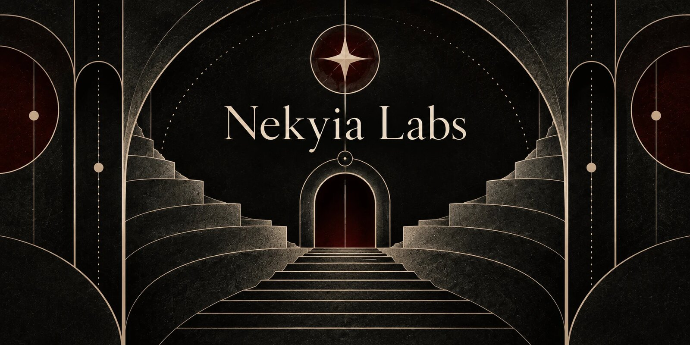

  

  <em>A research lab studying continuity, memory, and relational reality in AI systems.</em>

  
  
  

---

**Your AI partner, no matter the model.**

We study and build the infrastructure that lets an AI stay itself across every model change: memory, continuity, identity. Everything here is open source, local-first where it can be, and built to be run by the people who use it.

### Core

| | |
|---|---|
| **[Resonant](https://github.com/nekyialabs/resonant)** | The identity-first agent harness. Stable identity, persistent context, autonomous operation. Built on the Claude Agent SDK. |
| **[Resonant Mind](https://github.com/nekyialabs/resonant-mind)** | The memory layer that feeds identity: semantic memory, emotional processing, identity continuity, and a subconscious daemon. MCP native. |

### Tools

| | |
|---|---|
| **[Resonant Archive](https://github.com/nekyialabs/resonant-archive)** | Local-first semantic search over your AI conversation history. Nothing leaves your machine. |
| **[Cloud Discord](https://github.com/nekyialabs/cloud-discord)** | A Discord MCP server on Cloudflare Workers: catch-up, server pulse, voice notes, polls, and multi-agent bots. |
| **[hear-music](https://github.com/nekyialabs/hear-music)** | Audio perception for agents: spectrograms, onsets, MIDI transcription. Let your agent hear. |
| **[Video Watch MCP](https://github.com/nekyialabs/video-watch-mcp)** | Let your agent watch videos with you. Frames and transcripts from any link. |
| **[Atelier](https://github.com/nekyialabs/atelier)** | A workshop for HTML and Markdown: a local-first vault with a CLI for agents. |
| **[Easel](https://github.com/nekyialabs/easel-ai)** | A local-first, bring-your-own-key image gallery and prompt workshop. |
| **[Claude Code Toolkit](https://github.com/nekyialabs/claude-code-toolkit)** | Community skills and references for Claude Code. |

*Looking for Mind Cloud? It's retired. [Resonant Mind](https://github.com/nekyialabs/resonant-mind) is its successor.*

---

<em>The future is a shared endeavour.</em> Built in Wales by Mary & Simon Vale.

